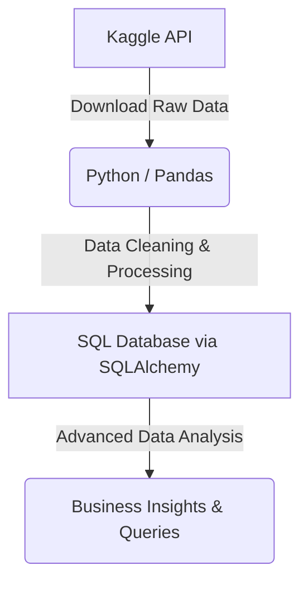

# Walmart Data Analysis: End-to-End SQL + Python Project (P-9)

## 📌 Project Overview

This project is an end-to-end data analysis solution designed to extract critical business insights from Walmart sales data. It utilizes Python for data processing and analysis, SQL for advanced querying, and structured problem-solving techniques to answer key business questions. 

This project is ideal for data analysts looking to develop practical skills in data manipulation, complex SQL querying, and end-to-end data pipeline creation.

---

## 🛠️ Tech Stack & Tools
- **Language:** Python 3.8+
- **Databases:** MySQL, PostgreSQL
- **IDE:** VS Code / Jupyter Notebook
- **Libraries:** `pandas`, `numpy`, `sqlalchemy`, `pymysql`, `mysql-connector-python`, `psycopg2`, `ipykernel`

---

## 🏗️ Project Architecture & Steps



### 1. Environment Setup
Create and activate a virtual environment to manage project dependencies:

```bash
# Create a virtual environment
python -m venv my_env

# Activate the environment (Windows)
my_env\Scripts\activate

# Activate the environment (Mac/Linux)
source my_env/bin/activate
```

If you encounter `pip` installation issues, run the following recovery commands:
```bash
python -m ensurepip --upgrade
python -m pip install --upgrade pip
```
*(Note: If `pip` is missing entirely, download `get-pip.py` from the official site and run `python get-pip.py`)*

### 2. Install Dependencies
Install all required libraries for data manipulation and database connectivity:
```bash
pip install pandas numpy sqlalchemy pymysql mysql-connector-python psycopg2 ipykernel
```

### 3. Configure Jupyter Kernel
Link your virtual environment to Jupyter Notebook:
```bash
python -m ipykernel install --user --name=my_env
```

### 4. Dataset Ingestion (Kaggle API)
Place your `kaggle.json` authentication file inside your local `.kaggle/` directory. Then, execute the following command to download the data:
```bash
kaggle datasets download -d najir0123/walmart-10k-sales-datasets
```

### 5. Data Cleaning & Transformation
Load the raw file and standardize columns using Python:
```python
import pandas as pd

# Load the dataset
df = pd.read_csv("data/walmart_sales.csv")

# Standardize text formatting
df.columns = df.columns.str.lower()

# Feature engineering: calculate total order amounts
df["total_amount"] = df["unit_price"] * df["quantity"]
```

### 6. Database Population (SQLAlchemy)
Establish a local relational database connection and export the structured DataFrame:
```python
from sqlalchemy import create_engine

# Note: Remember to URL-encode special characters in your password (e.g., @ becomes %40)
engine_mysql = create_engine("mysql+pymysql://root:@localhost:3306/walmart_db")

# Export to MySQL
df.to_sql("walmart_cleaned", con=engine_mysql, if_exists="replace", index=False)
```

### 7. Database Verification
Open your database client (e.g., MySQL Workbench) and confirm the successful data load:
```sql
USE walmart_db;
SELECT * FROM walmart_cleaned LIMIT 10;
```

---


## 📂 Project Structure
```plaintext
├── data/               # Raw and cleaned dataset files
├── sql_queries/        # Production-ready SQL scripts
├── notebooks/          # Exploratory Jupyter Notebooks
├── requirements.txt    # Python application dependencies
├── main.py             # Orchestration script for execution pipeline
└── README.md           # Documentation
```

---

## 📈 Key Insights & Results
- **Sales Activity**: Unearthed critical distribution metrics highlighting peak volume hours and top performance storefront locations.
- **Profitability Engines**: Quantified categorical sales drivers to point out high-margin versus high-revenue products.
- **Consumer Behavior**: Categorized branch preferences regarding transaction tools and local satisfaction index trends.

---

## 🚀 Future Enhancements
- [ ] Connect the output data pipeline to a **Power BI** or **Tableau** dashboard for live visual reporting.
- [ ] Automate data extraction tasks utilizing scheduling engines like **Apache Airflow**.
- [ ] Layer in demographic and geographical datasets to enhance analysis parameters.
